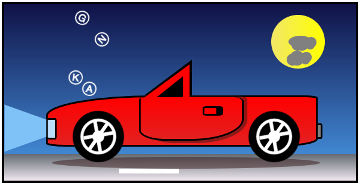

#Car Animation

####[Animation Demo](http://pauldkang.com/car/)
---

This car animation was fully created in HTML5 / CSS3. All shapes are made in html ```<div>```s by coloring their backgrounds and borders, assigning absolute or relative position, while properly nesting them within each other. ```@keyframes``` selectors in CSS were used to animate the images depicting a scene of a sports car cruising under the moonlight.


#####
---

####Code Examples

HTML
```html
<div class="upperPart">
	<div class="triangle">
		<div class="triangle-body">
			<div class="window"></div>
		</div>	
	</div>
</div>
<div class="body">
	<div class="door"></div>
	<div class="knob"></div>
	<div class="headlight"></div>
	<div class="tail-light"></div>
	<div class="light"></div>
</div>
```

CSS
```css
.light{
	border-bottom: 70px solid #bbdefb;
	border-left: 25px solid transparent;
	border-right: 25px solid transparent;
	height: 0;
	width: 29px;			
	transform: rotate(90deg);
	margin-left: -77px;
	margin-top: 17px;
	animation: blink .2s infinite linear;
}

@keyframes blink {
	0% {
		border-bottom-color: #bbdefb;
	}
	50%{
		border-bottom-color: #64b5f6;
	} 
	100%{
		border-bottom-color: #bbdefb;
	}
}
```